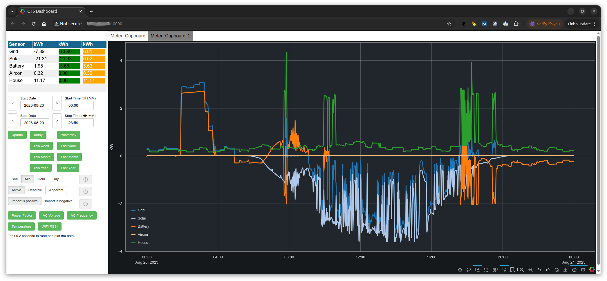

# CT6 Meter Project
For this project I developed the hardware to allow the measurement of household AC electrical energy usage on up to 6 circuits using current transformers (CT’s). It can be used to monitor solar system generation, storage battery charge/discharge, EV charging and household energy usage. Multiple CT6 devices can be used to monitor more circuits if required.

Each CT6 unit has 6 ports, each of which can be connected to a current transformer, clipped around a cable carrying AC mains power. Each port can measure the AC power flow bi directionally (I.E to and from the grid). The unit measures the active power (the power normally charged by a domestic electricity supplier), reactive and apparent power. The AC power factor, frequency and AC voltage is also measured along with the WiFi RSSI and CT6 device temperature.

## The CT6 hardware.

### CT6 Hardware details
Details of the CT6 hardware can be found [here](hardware/README.md).

## Installing CT6 Software Applications
Details of how to install the required CT6 software onto a Windows or Linux machine can be found [here](software/server/installers/README.md).

## The CT6 Software Applications
An overview of the CT6 software applications are shown below.

- ct6_app

When at least one CT6 device is connected to your WiFi network you can start this app. This app will
find all CT6 units. These CT6 units will send data which is stored in an sqlite database. A server is then started and a browser window will open, connected to the server, to display the data from the database as shown.

- ct6_configurator

The ct6 configurator app allows the user to setup/configure a CT6 unit via a GUI interface. This includes connecting it to your WiFi, upgrading it to the latest firmware. Click [here](software/server/setting_up_ct6_units.md).

- ct6_db_store

Similar to part of the ct6_app in that it detects all CT6 units on the LAN/WiFi and stores the data in a database. However the database is a mysql database. This allows for a more scalable system than the ct6_app.

- ct6_dash

This presents the data stored in the above mysql database and presents a GUI in a web browser as displayed above.

- ct6_dash_mgr

Both the ct6_app and the ct6_dash app present a GUI in a browser interface via a local web server. This app allows you to configure credentials (username/password) to allow access to the web server. The ct6_app and ct6_dash apps must be configured to require a login in order to use these credentials.

- ct6_mfg_tool

This tool is used to load SW and perform manufacturing tests on CT6 hardware in order to commission them.

- ct6_stats

This finds CT6 devices on the LAN/WiFi and displays the JSON data received from CT6 devices.

- ct6_tool

This provides functionality that is useful when checking the operation of CT6 units in a development environment.

More details of how to use the installed software applications can be found [here](software/server/README.md).

# Purchasing CT6 units
Complete CT6 units or assembled PCB's and associated parts can be purchased on Tindie at https://www.tindie.com/products/pausten/ct6-energy-monitor/

# Warning
This project is designed to use the YHDC SCT013 100A 0-1V split core current transformer. As mains voltage is dangerous it is the users responsibility to connect these current clamps safely using this hardware.
