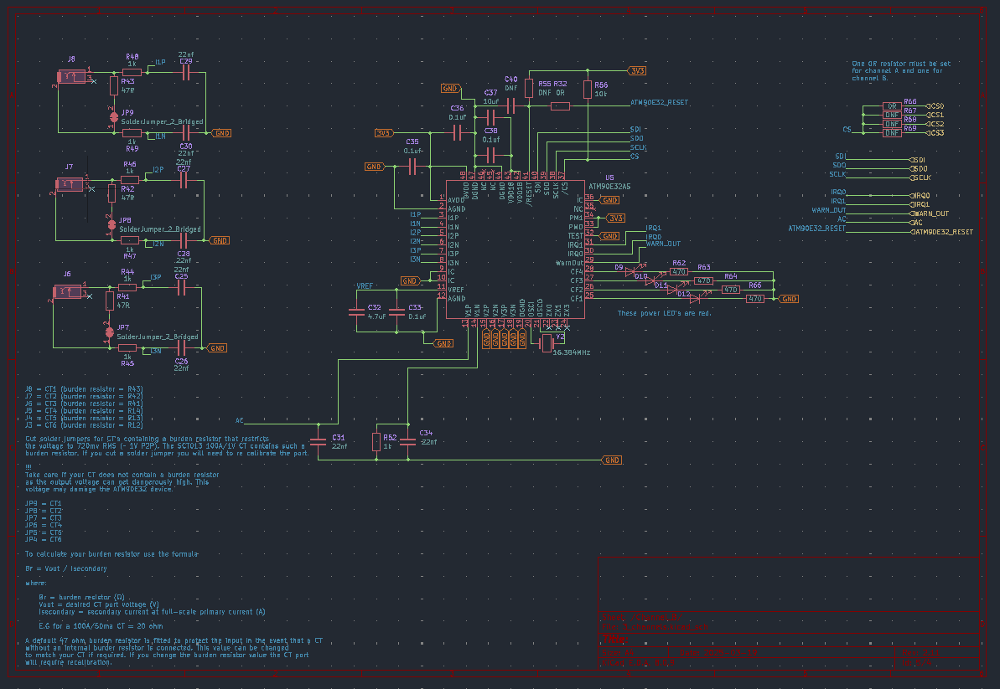
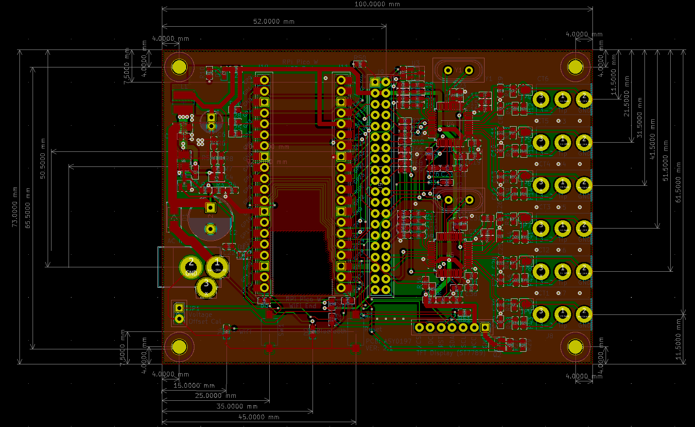

# CT6 Hardware

## Schematic

The schematic was created against the requirements for the project with reference
to the data sheets for the various parts.

## PCB
The PCB was created from the above schematic. The final PCB is shown
below.

# Current transformer

This project is designed to use only the YHDC SCT013 100A 0-1V split core current transformer as shown below.

These can be plugged into ports 1 - 6 to provide up to six separate bi directional measurements of AC power. When clipping the current transformer around the live AC wire the face shown above should be on the AC supply (grid) side.

## Case
The Case was designed using [FreeCad](https://www.freecad.org/). The various
parts of the case are shown below.

The [case](case) folder contains the FreeCad (0.20.2) design files for this project.

## Power Supply
This project requires the use of an AC - AC supply. Examples of suitable power supplies are detailed below.

1 [Power supply A](https://uk.farnell.com/ideal-power/77db-10-15m/power-supply-ac-ac-11-5w-15v-0/dp/2368009?st=15v%20ac%20power%20supply)

2 [Power supply B](https://www.ebay.co.uk/itm/235232679606)

Note !!!

The power supply must output an AC voltage between 9 and 16 volts with a 2.1 mm DC DC barrel connector. A DC power supply will not power the unit. A calibration process is required for the power supply fitted to the unit to ensure the voltage and power measurements are correct.
