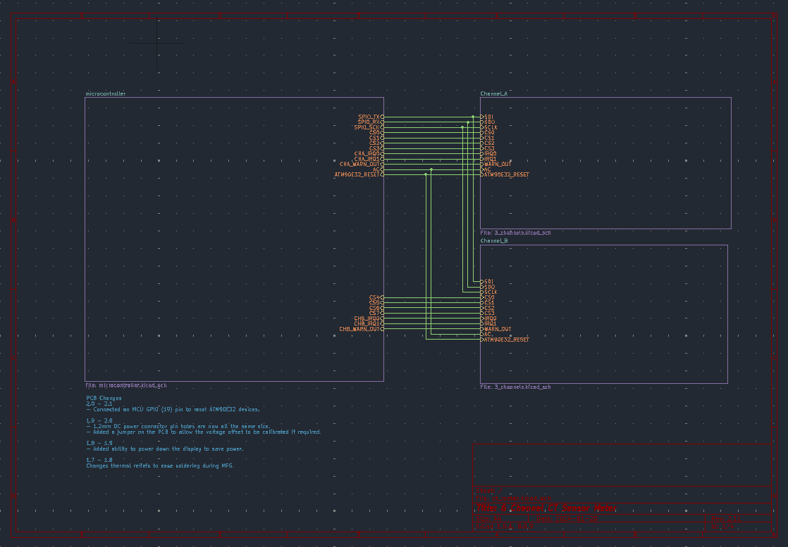
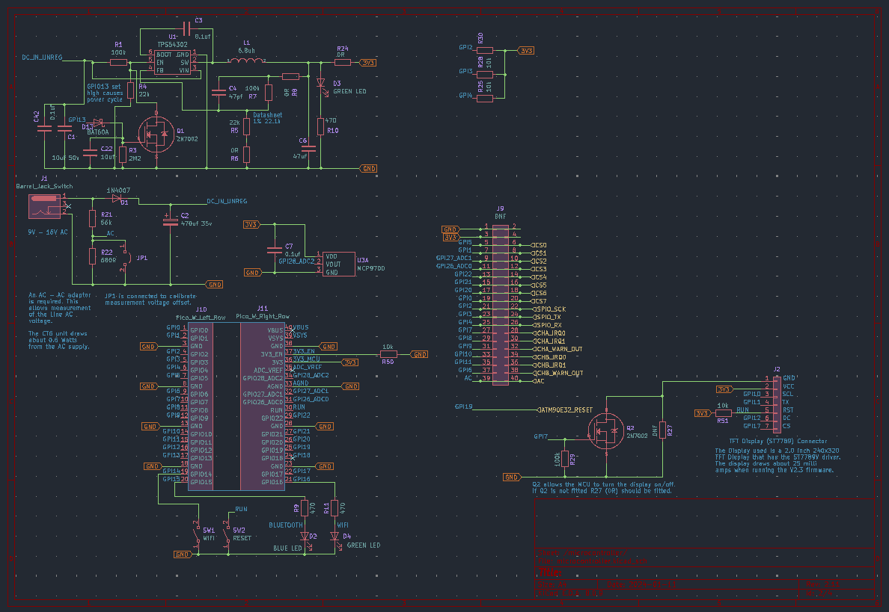
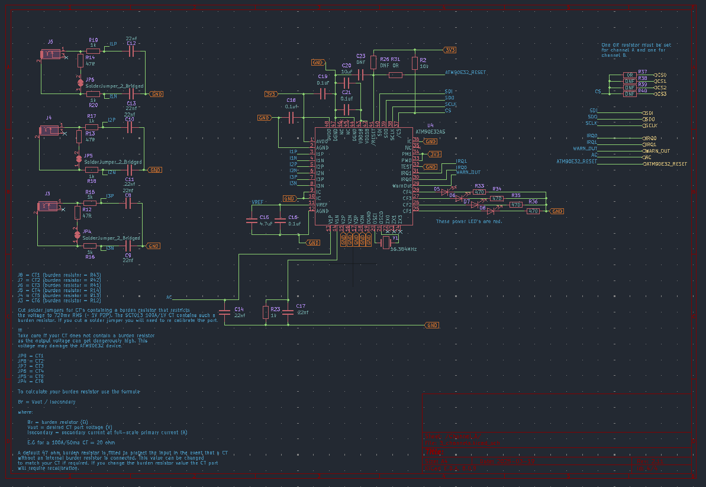

# CT6 Hardware

## Schematic

The schematic was created against the requirements for the project with reference
to the data sheets for the various parts.

## PCB
The PCB was created from the above schematic. The final PCB is shown
below.

# Current transformer

This project is tested with the YHDC SCT013 100A 0-1V split core current transformer when manufactured. If you wish to use a different current transformer then you must calibrate the unit as detailed at the end of [this](../software/server/setting_up_ct6_units.md) document.

These can be plugged into ports 1 - 6 to provide up to six separate bi directional measurements of AC power. When clipping the current transformer around the live AC wire it is recommended that the face shown above should be on the AC supply (grid) side. This results in -ve power values for imported energy and +ve power values for generated energy. If you wish to have +ve values for imported energy then reverse the current transformer. It should be possible to use other current transformers but they will need calibration as detailed above. The schematic now includes notes (channel a and channel b) that provides more details on this.

## Case
The Case was designed using [FreeCad](https://www.freecad.org/). The various
parts of the case are shown below.

The two small holes in the above part are drilled using a 1.8mm drill bit. Then a length of clear PETG filament is inserted
into the hole. Each end is then cut off to create light pipes.

The [case](case) folder contains the FreeCad (0.20.2) design files for this project.

### Dissembling a CT6 unit

Some info on how to take a CT6 unit apart if you want access to the PCB can be found here [here](README_DISSEMBLY.md)

## Power Supply
This project requires the use of an AC - AC supply. If you purchase a CT6 unit the CT6 PCB assembly will have been calibrated using the power supply detailed below.

[AC - AC Power supply](https://www.ebay.co.uk/itm/235232679606)

Note !!!

The power supply must output an AC voltage between 9 and 16 volts with a 2.1 mm DC DC barrel connector. A DC power supply will not power the unit. A calibration process is required for the power supply fitted to the unit to ensure the voltage and power measurements are correct.
