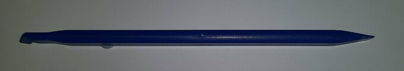
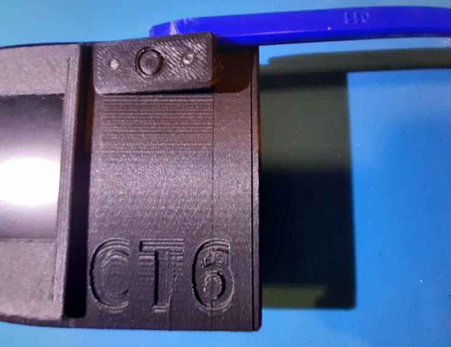
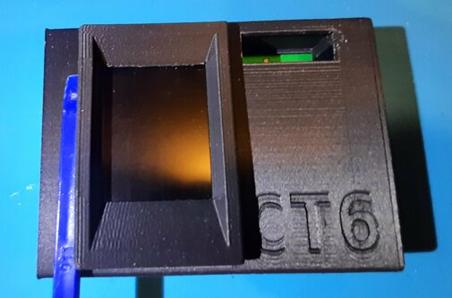
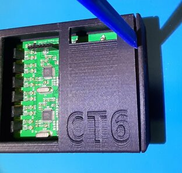
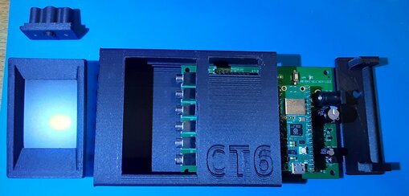
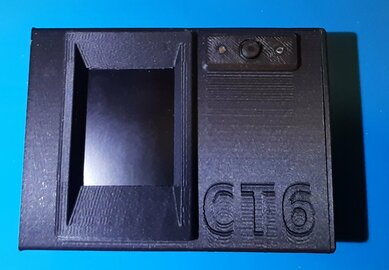

# Disassembling a CT6 unit.

The CT6 unit case is 3d printed and it's parts snap together. In order to take it apart it is useful to have a plastic tool that is used to take apart mobile phones. This tool is shown below.

To disassemble a CT6 unit you should follow the following sequence of steps.

To remove the LED and button panel use the tool as shown below.

To remove the display use the tool as shown below.

Note ! When assembling a CT6 unit ensure the display is pushed home square to ensure the display connector is in the correct position inside the box.

To remove the box end cap use the tool as shown below.

A dissembled CT6 unit is shown below.

An assembled CT6 unit is shown below.

