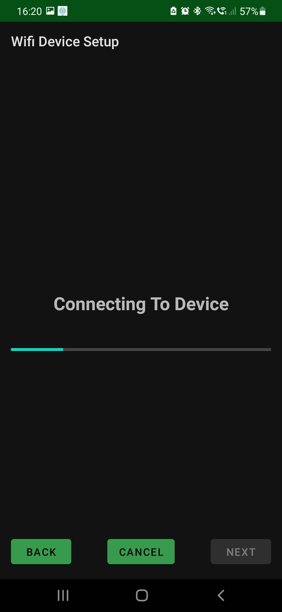
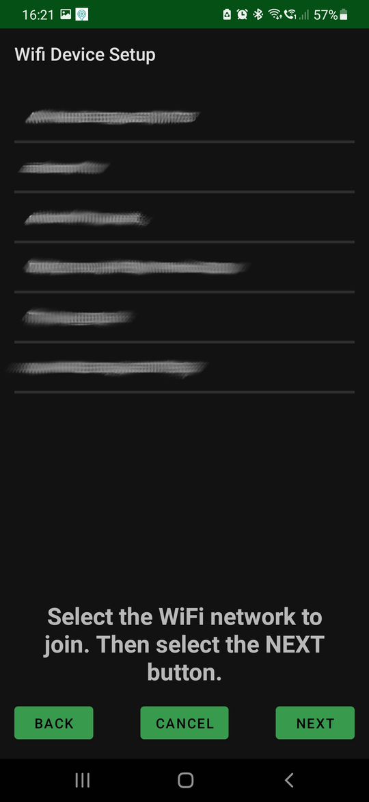
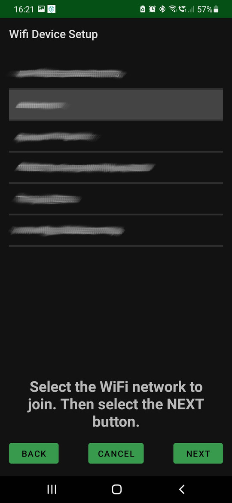
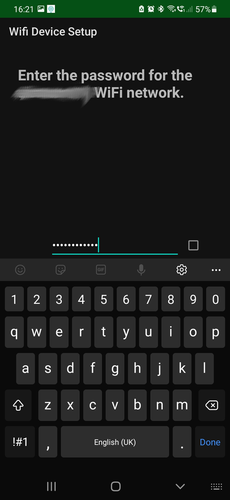
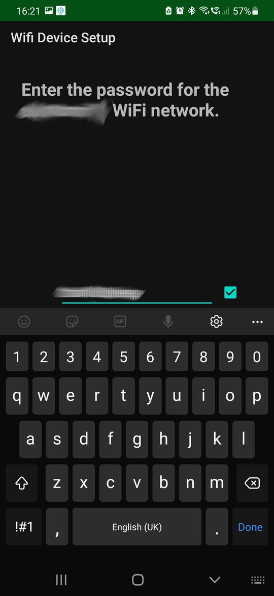
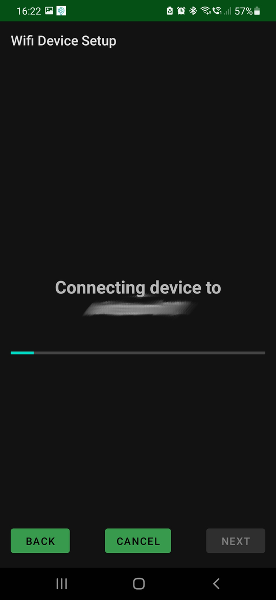
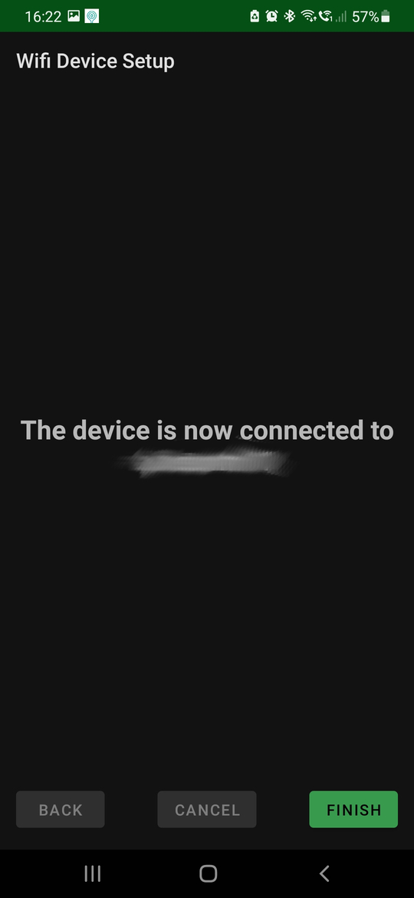
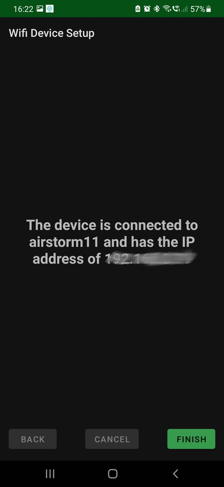

# Android application
This android application was developed to allow the user to program the  
WiFi interface on the device in order that it will register on a
WiFi (2.4 GHz) network.

It does this by communication with microcontroller on the unit
over bluetooth and guiding the user through the process of configuring the
WiFi as detailed below.

# Installing the Android App
To install the Android app on your Android device (phone or tablet) you need to
have Android Studio (https://developer.android.com/studio) installed on your PC.

Before being able to compile the SetupYDevWifi Android Studio project 
you need to add the local.properties file to the Android_App/SetupYDevWifi
folder. This tells AndroidStudio where to find the Android SDK.

E.G

```
## This file must *NOT* be checked into Version Control Systems,
# as it contains information specific to your local configuration.
#
# Location of the SDK. This is only used by Gradle.
# For customization when using a Version Control System, please read the
# header note.
#Thu Feb 15 05:53:03 GMT 2024
sdk.dir=/home/<USERNAME>/Android/Sdk
```

where <USERNAME> is your username. This is the local path where the Android SDK is installed.


Once this has been done you should be able to open the SetupYDevWifi project from the
Android_App folder. 

Connect your Android device (phone or tablet) via a USB cable to the PC running Android studio once you
have enabled USB debugging under developer options on your Android phone/tablet under developer options.

Once the above is complete clicking the Run/Play button in the Android Studio toolbar will compile the app, deploy the app to your Android device and start it running. This will install the app on you android device. Therefore you will be able to launch it by selecting the 'WiFi Device Setup' icon.


# Using the App.
Start the app by selecting the ''WiFi Device Setup' icon as shown below on
your Android device.


The following should then be displayed.


At this point the button on the device should be held down until the blue and green LED's start flashing. Then select the Next button and the following should be displayed.



After several (up to 60) seconds the blue LED on the device should turn on solid. This indicates that a blue tooth connection has been established with the device. The device will then scan for WiFi networks and display the ones it found as shown below. If the WiFi network that you wish to connect to is not listed then select the back button, followed by the Next button to re scan for WiFi networks until the WiFi network is displayed.



The WiFi networks will then be displayed. Select the network that you wish to connect to as shown below.



Then select the Next button and the following will be displayed to allow the WiFi network password to be entered.



The WiFi password entered will be shown as a line of dots as shown above.
If you wish to view the password you entered you may click the checkbox icon to the right of the password and the password will be displayed as shown below.



When you are sure that you have entered the correct password select the Done key on the displayed keyboard. An attempt will then be made to connect the device to the WiFi network as shown below.



When a successful connection has been made the following screen will be displayed.



At this point if the 'The device is now connected to' text is selected then the IP address that the unit has been given will be displayed as shown below.



At this point the WiFi interface is setup correctly and the Finish button may be selected to close the app.
