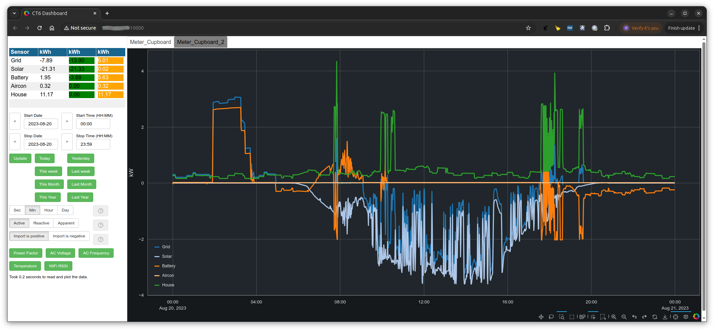

# CT6 Applications
The CT6 hardware is responsible for measuring the bi directional power from
up to 6 CT sensors. The hardware allows CT6 units to be stacked to provide up
to 24 bi directional CT ports. However the software does not currently support
more than 6 ports per unit. A CT6 device can operate in two modes. 

- Mode 1
This is the normal operating mode when the ct6_db_store app is used to save data to
a database and the ct6_dash app is used to start a webserver that allows access to
the CT6 data. A CT6 device will be in Mode 1 if no MQTT server is configured on 
the CT6 device. Details of how to configure a CT6 device can be 
found [here](setting_up_ct6_units.md).

- Mode 2
Send data to an MQTT server. In this case the CT6 device must be configured to
send data to an MQTT server. Details of how to configure a CT6 device can be 
found [here](setting_up_ct6_units.md). The ability to send data to an MQTT server
allows integration with other systems (E.G [ioBroker](https://www.iobroker.net/)).


# Using the built in server apps.
The server apps may be installed onto a Linux or Windows machine as 
detailed [here](installers/README.md). The CT6 device must be configured as detailed
[here](setting_up_ct6_units.md) not to send data to an MQTT server (no MQTT Server 
Address configured). In this mode the following apps can be used.

## Setup a MYSQL server
Before starting the apps a MYSQL database is required to store the data from CT6 units. Details of how the MYSQL 
database can be setup on windows and Linux platforms can be found [here](install_docker_and_mysql.md).

## ct6_db_store app
This application is responsible for sending messages to CT6 devices on your LAN and saving the responses from CT6 devices to the MYSQL database.

The ct6_db_store app can be started from the command line on Windows (Powershell window) and 
Linux (terminal window) platforms. 

Before using the ct6_db_store app it must be configured to connect to the MYSQL database.
Start the ct6_db_store app with the -c command line option as shown below to configure
the required settings.

```
ct6_db_store -c


INFO:  Loaded config from /home/username/.ct6DBStore.cfg
INFO:  Saved config to /home/username/.ct6DBStore.cfg
INFO:  ID  PARAMETER           VALUE
INFO:  1   ICONS_ADDRESS       127.0.0.1
INFO:  2   ICONS_PORT          22
INFO:  3   ICONS_USERNAME      
INFO:  4   ICONS_SSH_KEY_FILE  /home/username/.ssh/id_rsa
INFO:  5   MQTT_TOPIC          HOME/#
INFO:  6   DB_HOST             192.168.0.22
INFO:  7   DB_PORT             3306
INFO:  8   DB_USERNAME         root
INFO:  9   DB_PASSWORD         changeme
INPUT: Enter 'E' to edit a parameter, or 'Q' to quit:
```

ID's  1,2,3 and 4 can be left at the default values or unset. They are not currently used.

ID 5  Should be set to 'HOME/#'.

ID 6  Should be set to the IP address of the Windows or Linux machine on your LAN.

ID 7  This can be left at 3306 unless the MYSQL docker container is setup for a different port.

ID 8  The database username can be left as root

ID 9  Ensure the password is set to the password used when the mysql docker container was created.

Once this has been completed 'Q' should be entered to quit the ct6_db_tool app.


Once the above configuration is complete the ct6_db_store app must be started without the -c 
command line argument as shown below.

```
ct6_db_store
INFO:  Loaded config from /home/username/.ct6DBStore.cfg
INFO:  Saved config to /home/username/.ct6DBStore.cfg
INFO:  Creating Hour and Day tables...
INFO:  Connecting to 192.168.0.22:3306
INFO:  Connected
INFO:  Deleted CT6_SENSOR_MINUTE database table.
INFO:  Deleted CT6_SENSOR_HOUR database table.
INFO:  Deleted CT6_SENSOR_DAY database table.
INFO:  Created CT6_SENSOR_MINUTE table in Meter_Cupboard.
INFO:  Created CT6_SENSOR_HOUR table in Meter_Cupboard.
INFO:  Created CT6_SENSOR_DAY table in Meter_Cupboard.
INFO:  Creating derived tables in Meter_Cupboard.
INFO:  Took 7.0 seconds to write CT6_SENSOR_MINUTE table in Meter_Cupboard
INFO:  Took 0.1 seconds to write CT6_SENSOR_HOUR table in Meter_Cupboard
INFO:  Took 0.0 seconds to write CT6_SENSOR_DAY table in Meter_Cupboard
INFO:  Created CT6_SENSOR_MINUTE_INDEX in Meter_Cupboard.
INFO:  Created CT6_SENSOR_HOUR_INDEX in Meter_Cupboard.
INFO:  Created CT6_SENSOR_DAY_INDEX in Meter_Cupboard.
INFO:  Took 9.0 seconds to create derived tables in Meter_Cupboard
INFO:  Derived tables created.
INFO:  Disconnected from 192.168.0.22:3306
INFO:  Connected to MySQL server.
INFO:  Sending AYT messages.
INFO:  Listening on UDP port 29340
INFO:  Found device on 192.168.0.34
```

The ct6_db_store is now storing data it receives from CT6 units. If multiple units are found they will be 
stored in different databases. The name of each database will be the configured name of the CT6 device.


## ct6_dash app
Once the ct6_db_store app is running the ct6_dash (dashboard) app can be used to start a webserver that
provides GUI access to the data.

Before using the ct6_dash app it must be configured to connect to the MYSQL database.
Start the ct6_dash app with the -c command line options as shown below to configure
the required settings.

```
ct6_dash -c
INFO:  Loaded config from /home/username/.ct6Dash.cfg
INFO:  Saved config to /home/username/.ct6Dash.cfg
INFO:  ID  PARAMETER                 VALUE
INFO:  1   DB_HOST                   192.168.0.22
INFO:  2   DB_PORT                   3306
INFO:  3   DB_USERNAME               root
INFO:  4   DB_PASSWORD               changeme
INFO:  5   LOCAL_GUI_SERVER_ADDRESS  192.168.0.23
INFO:  6   LOCAL_GUI_SERVER_PORT     10000
INPUT: Enter 'E' to edit a parameter, or 'Q' to quit:
```

1 = The host address of the machine running the MYSQL database.

2 = The TCP port number to connect to the database.

3 = The username of the database.

4 = The password for access to the database.

5 = The address of the local machine on your LAN.

6 = The TCP port number to present the web server on.


Once this has been completed 'Q' should be entered to quit the ct6_dash app.


Once the above configuration is complete the ct6_dash app must be started without the -c 
command line argument as shown below.

```
ct6_dash
INFO:  Loaded config from /home/username/.ct6Dash.cfg
INFO:  Saved config to /home/username/.ct6Dash.cfg
INFO:  Connected to MySQL server.
```

When the above command issued a local web browser will be automatically started and connected to the ct6_dash webserver. 




