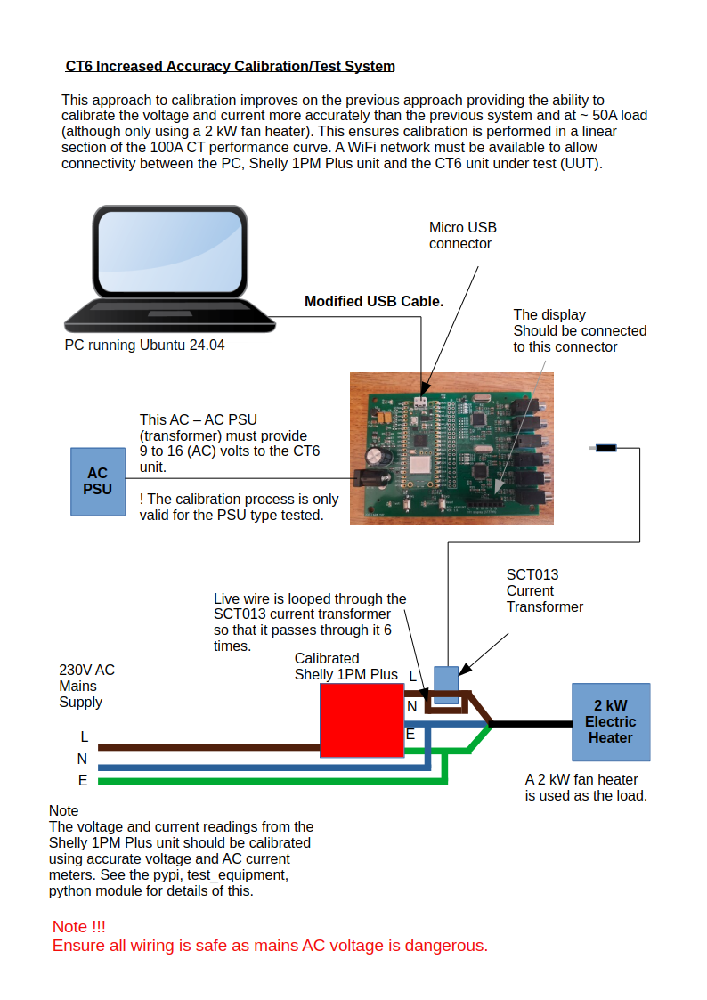

# CT6 Test and Calibration.
This document details how to install the software onto the RPi Pico W on the CT6 unit, test it and calibrate it.

## Installation of SW
To use the tools to test and calibrate a CT6 unit the Linux package must be installed.
This installer has to be built first. To build the installer perform the following

```
./build.sh
----------------------------------------------------------------------
Ran 4 tests in 0.014s

OK
Loading configuration file /home/pja/.config/pypoetry/config.toml
Using virtualenv: /home/pja/.cache/pypoetry/virtualenvs/ct6-HDEVhVyI-py3.12
Building ct6 (10.3)
  - Building sdist
Ignoring: tests/lib/__pycache__/__init__.cpython-312.pyc
Ignoring: ct6/__pycache__/ct6_configurator.cpython-312.pyc
Ignoring: lib/__pycache__/config.cpython-312.pyc
Ignoring: tests/lib/__pycache__/base_constants.cpython-312.pyc
Ignoring: tests/__pycache__/mean_stats.cpython-312.pyc
Ignoring: ct6/__pycache__/ct6_mfg_tool.cpython-312.pyc
Ignoring: lib/__pycache__/__init__.cpython-312.pyc
Ignoring: ct6/__pycache__/__init__.cpython-312.pyc
Ignoring: lib/__pycache__/yview.cpython-312.pyc
Ignoring: lib/__pycache__/base_constants.cpython-312.pyc
Ignoring: tests/__pycache__/constants.cpython-312.pyc
Ignoring: dist/ct6-10.3.tar.gz
Ignoring: ct6/__pycache__/ct6_tool.cpython-312.pyc
  - Adding: /home/pja/git-repos/ct6_meter_os/software/server/ct6/.gitignore
  - Adding: /home/pja/git-repos/ct6_meter_os/software/server/ct6/__init__.py
  - Adding: /home/pja/git-repos/ct6_meter_os/software/server/ct6/ct6_configurator.py
  - Adding: /home/pja/git-repos/ct6_meter_os/software/server/ct6/ct6_dash.py
  - Adding: /home/pja/git-repos/ct6_meter_os/software/server/ct6/ct6_dash_mgr.py
  - Adding: /home/pja/git-repos/ct6_meter_os/software/server/ct6/ct6_db_store.py
  - Adding: /home/pja/git-repos/ct6_meter_os/software/server/ct6/ct6_mfg_tool.py
  - Adding: /home/pja/git-repos/ct6_meter_os/software/server/ct6/ct6_stats.py
  - Adding: /home/pja/git-repos/ct6_meter_os/software/server/ct6/ct6_tool.py
  - Adding: /home/pja/git-repos/ct6_meter_os/software/server/lib/.gitignore
  - Adding: /home/pja/git-repos/ct6_meter_os/software/server/lib/__init__.py
  - Adding: /home/pja/git-repos/ct6_meter_os/software/server/lib/base_constants.py
  - Adding: /home/pja/git-repos/ct6_meter_os/software/server/lib/config.py
  - Adding: /home/pja/git-repos/ct6_meter_os/software/server/lib/db_handler.py
  - Adding: /home/pja/git-repos/ct6_meter_os/software/server/lib/ngt_examples.py
  - Adding: /home/pja/git-repos/ct6_meter_os/software/server/lib/yview.py
  - Adding: /home/pja/git-repos/ct6_meter_os/software/server/picow/.gitignore
  - Adding: /home/pja/git-repos/ct6_meter_os/software/server/picow/README.md
  - Adding: /home/pja/git-repos/ct6_meter_os/software/server/picow/app1/__init__.py
  - Adding: /home/pja/git-repos/ct6_meter_os/software/server/picow/app1/app.py
  - Adding: /home/pja/git-repos/ct6_meter_os/software/server/picow/app1/cmd_handler.py
  - Adding: /home/pja/git-repos/ct6_meter_os/software/server/picow/app1/constants.py
  - Adding: /home/pja/git-repos/ct6_meter_os/software/server/picow/app1/lib/__init__.py
  - Adding: /home/pja/git-repos/ct6_meter_os/software/server/picow/app1/lib/base_cmd_handler.py
  - Adding: /home/pja/git-repos/ct6_meter_os/software/server/picow/app1/lib/base_constants.py
  - Adding: /home/pja/git-repos/ct6_meter_os/software/server/picow/app1/lib/base_machine.py
  - Adding: /home/pja/git-repos/ct6_meter_os/software/server/picow/app1/lib/bluetooth.py
  - Adding: /home/pja/git-repos/ct6_meter_os/software/server/picow/app1/lib/config.py
  - Adding: /home/pja/git-repos/ct6_meter_os/software/server/picow/app1/lib/drivers/__init__.py
  - Adding: /home/pja/git-repos/ct6_meter_os/software/server/picow/app1/lib/drivers/atm90e32.py
  - Adding: /home/pja/git-repos/ct6_meter_os/software/server/picow/app1/lib/drivers/st7789.py
  - Adding: /home/pja/git-repos/ct6_meter_os/software/server/picow/app1/lib/fs.py
  - Adding: /home/pja/git-repos/ct6_meter_os/software/server/picow/app1/lib/hardware.py
  - Adding: /home/pja/git-repos/ct6_meter_os/software/server/picow/app1/lib/io.py
  - Adding: /home/pja/git-repos/ct6_meter_os/software/server/picow/app1/lib/rest_server.py
  - Adding: /home/pja/git-repos/ct6_meter_os/software/server/picow/app1/lib/umqttsimple.py
  - Adding: /home/pja/git-repos/ct6_meter_os/software/server/picow/app1/lib/uo.py
  - Adding: /home/pja/git-repos/ct6_meter_os/software/server/picow/app1/lib/wifi.py
  - Adding: /home/pja/git-repos/ct6_meter_os/software/server/picow/app1/lib/ydev.py
  - Adding: /home/pja/git-repos/ct6_meter_os/software/server/picow/app1/mean_stats.py
  - Adding: /home/pja/git-repos/ct6_meter_os/software/server/picow/app1/project.py
  - Adding: /home/pja/git-repos/ct6_meter_os/software/server/picow/app1/vga2_bold_16x16.py
  - Adding: /home/pja/git-repos/ct6_meter_os/software/server/picow/app2/__init__.py
  - Adding: /home/pja/git-repos/ct6_meter_os/software/server/picow/main.py
  - Adding: /home/pja/git-repos/ct6_meter_os/software/server/picow/tools/.gitignore
  - Adding: /home/pja/git-repos/ct6_meter_os/software/server/picow/tools/esp32_erase_flash.sh
  - Adding: /home/pja/git-repos/ct6_meter_os/software/server/picow/tools/esp32_start_rshell.sh
  - Adding: /home/pja/git-repos/ct6_meter_os/software/server/picow/tools/main.py
  - Adding: /home/pja/git-repos/ct6_meter_os/software/server/picow/tools/picow_erase_flash.sh
  - Adding: /home/pja/git-repos/ct6_meter_os/software/server/picow/tools/picow_flash_images/firmware.uf2
  - Adding: /home/pja/git-repos/ct6_meter_os/software/server/picow/tools/picow_flash_images/flash_nuke.uf2
  - Adding: /home/pja/git-repos/ct6_meter_os/software/server/picow/tools/picow_micropython_flash.sh
  - Adding: /home/pja/git-repos/ct6_meter_os/software/server/picow/tools/picow_start_rshell.sh
  - Adding: /home/pja/git-repos/ct6_meter_os/software/server/pyproject.toml
  - Adding: pyproject.toml
  - Adding: README.md
  - Built ct6-10.3.tar.gz
  - Building wheel
Ignoring: tests/lib/__pycache__/__init__.cpython-312.pyc
Ignoring: ct6/__pycache__/ct6_configurator.cpython-312.pyc
Ignoring: lib/__pycache__/config.cpython-312.pyc
Ignoring: tests/lib/__pycache__/base_constants.cpython-312.pyc
Ignoring: tests/__pycache__/mean_stats.cpython-312.pyc
Ignoring: ct6/__pycache__/ct6_mfg_tool.cpython-312.pyc
Ignoring: lib/__pycache__/__init__.cpython-312.pyc
Ignoring: ct6/__pycache__/__init__.cpython-312.pyc
Ignoring: lib/__pycache__/yview.cpython-312.pyc
Ignoring: lib/__pycache__/base_constants.cpython-312.pyc
Ignoring: tests/__pycache__/constants.cpython-312.pyc
Ignoring: dist/ct6-10.3.tar.gz
Ignoring: ct6/__pycache__/ct6_tool.cpython-312.pyc
  - Adding: /home/pja/git-repos/ct6_meter_os/software/server/ct6/.gitignore
  - Adding: /home/pja/git-repos/ct6_meter_os/software/server/ct6/__init__.py
  - Adding: /home/pja/git-repos/ct6_meter_os/software/server/ct6/ct6_configurator.py
  - Adding: /home/pja/git-repos/ct6_meter_os/software/server/ct6/ct6_dash.py
  - Adding: /home/pja/git-repos/ct6_meter_os/software/server/ct6/ct6_dash_mgr.py
  - Adding: /home/pja/git-repos/ct6_meter_os/software/server/ct6/ct6_db_store.py
  - Adding: /home/pja/git-repos/ct6_meter_os/software/server/ct6/ct6_mfg_tool.py
  - Adding: /home/pja/git-repos/ct6_meter_os/software/server/ct6/ct6_stats.py
  - Adding: /home/pja/git-repos/ct6_meter_os/software/server/ct6/ct6_tool.py
  - Adding: /home/pja/git-repos/ct6_meter_os/software/server/lib/.gitignore
  - Adding: /home/pja/git-repos/ct6_meter_os/software/server/lib/__init__.py
  - Adding: /home/pja/git-repos/ct6_meter_os/software/server/lib/base_constants.py
  - Adding: /home/pja/git-repos/ct6_meter_os/software/server/lib/config.py
  - Adding: /home/pja/git-repos/ct6_meter_os/software/server/lib/db_handler.py
  - Adding: /home/pja/git-repos/ct6_meter_os/software/server/lib/ngt_examples.py
  - Adding: /home/pja/git-repos/ct6_meter_os/software/server/lib/yview.py
  - Adding: /home/pja/git-repos/ct6_meter_os/software/server/picow/.gitignore
  - Adding: /home/pja/git-repos/ct6_meter_os/software/server/picow/README.md
  - Adding: /home/pja/git-repos/ct6_meter_os/software/server/picow/app1/__init__.py
  - Adding: /home/pja/git-repos/ct6_meter_os/software/server/picow/app1/app.py
  - Adding: /home/pja/git-repos/ct6_meter_os/software/server/picow/app1/cmd_handler.py
  - Adding: /home/pja/git-repos/ct6_meter_os/software/server/picow/app1/constants.py
  - Adding: /home/pja/git-repos/ct6_meter_os/software/server/picow/app1/lib/__init__.py
  - Adding: /home/pja/git-repos/ct6_meter_os/software/server/picow/app1/lib/base_cmd_handler.py
  - Adding: /home/pja/git-repos/ct6_meter_os/software/server/picow/app1/lib/base_constants.py
  - Adding: /home/pja/git-repos/ct6_meter_os/software/server/picow/app1/lib/base_machine.py
  - Adding: /home/pja/git-repos/ct6_meter_os/software/server/picow/app1/lib/bluetooth.py
  - Adding: /home/pja/git-repos/ct6_meter_os/software/server/picow/app1/lib/config.py
  - Adding: /home/pja/git-repos/ct6_meter_os/software/server/picow/app1/lib/drivers/__init__.py
  - Adding: /home/pja/git-repos/ct6_meter_os/software/server/picow/app1/lib/drivers/atm90e32.py
  - Adding: /home/pja/git-repos/ct6_meter_os/software/server/picow/app1/lib/drivers/st7789.py
  - Adding: /home/pja/git-repos/ct6_meter_os/software/server/picow/app1/lib/fs.py
  - Adding: /home/pja/git-repos/ct6_meter_os/software/server/picow/app1/lib/hardware.py
  - Adding: /home/pja/git-repos/ct6_meter_os/software/server/picow/app1/lib/io.py
  - Adding: /home/pja/git-repos/ct6_meter_os/software/server/picow/app1/lib/rest_server.py
  - Adding: /home/pja/git-repos/ct6_meter_os/software/server/picow/app1/lib/umqttsimple.py
  - Adding: /home/pja/git-repos/ct6_meter_os/software/server/picow/app1/lib/uo.py
  - Adding: /home/pja/git-repos/ct6_meter_os/software/server/picow/app1/lib/wifi.py
  - Adding: /home/pja/git-repos/ct6_meter_os/software/server/picow/app1/lib/ydev.py
  - Adding: /home/pja/git-repos/ct6_meter_os/software/server/picow/app1/mean_stats.py
  - Adding: /home/pja/git-repos/ct6_meter_os/software/server/picow/app1/project.py
  - Adding: /home/pja/git-repos/ct6_meter_os/software/server/picow/app1/vga2_bold_16x16.py
  - Adding: /home/pja/git-repos/ct6_meter_os/software/server/picow/app2/__init__.py
  - Adding: /home/pja/git-repos/ct6_meter_os/software/server/picow/main.py
  - Adding: /home/pja/git-repos/ct6_meter_os/software/server/picow/tools/.gitignore
  - Adding: /home/pja/git-repos/ct6_meter_os/software/server/picow/tools/esp32_erase_flash.sh
  - Adding: /home/pja/git-repos/ct6_meter_os/software/server/picow/tools/esp32_start_rshell.sh
  - Adding: /home/pja/git-repos/ct6_meter_os/software/server/picow/tools/main.py
  - Adding: /home/pja/git-repos/ct6_meter_os/software/server/picow/tools/picow_erase_flash.sh
  - Adding: /home/pja/git-repos/ct6_meter_os/software/server/picow/tools/picow_flash_images/firmware.uf2
  - Adding: /home/pja/git-repos/ct6_meter_os/software/server/picow/tools/picow_flash_images/flash_nuke.uf2
  - Adding: /home/pja/git-repos/ct6_meter_os/software/server/picow/tools/picow_micropython_flash.sh
  - Adding: /home/pja/git-repos/ct6_meter_os/software/server/picow/tools/picow_start_rshell.sh
  - Adding: /home/pja/git-repos/ct6_meter_os/software/server/pyproject.toml
  - Built ct6-10.3-py3-none-any.whl
```

To install the deb file perform the following command. Note that the version of the package may change.

```
pipx uninstall ct6
uninstalled ct6! ✨ 🌟 ✨
(ct6-py3.12) pja@L7490:~/git-repos/ct6_meter_os/software/server$ pipx install installers/ct6-10.3-py3-none-any.whl
⚠️  Note: ct6_configurator was already on your PATH at /home/pja/.cache/pypoetry/virtualenvs/ct6-HDEVhVyI-py3.12/bin/ct6_configurator
⚠️  Note: ct6_dash was already on your PATH at /home/pja/.cache/pypoetry/virtualenvs/ct6-HDEVhVyI-py3.12/bin/ct6_dash
⚠️  Note: ct6_dash_mgr was already on your PATH at /home/pja/.cache/pypoetry/virtualenvs/ct6-HDEVhVyI-py3.12/bin/ct6_dash_mgr
⚠️  Note: ct6_db_store was already on your PATH at /home/pja/.cache/pypoetry/virtualenvs/ct6-HDEVhVyI-py3.12/bin/ct6_db_store
⚠️  Note: ct6_mfg_tool was already on your PATH at /home/pja/.cache/pypoetry/virtualenvs/ct6-HDEVhVyI-py3.12/bin/ct6_mfg_tool
⚠️  Note: ct6_stats was already on your PATH at /home/pja/.cache/pypoetry/virtualenvs/ct6-HDEVhVyI-py3.12/bin/ct6_stats
⚠️  Note: ct6_tool was already on your PATH at /home/pja/.cache/pypoetry/virtualenvs/ct6-HDEVhVyI-py3.12/bin/ct6_tool
  installed package ct6 10.3, installed using Python 3.12.3
  These apps are now globally available
    - ct6_configurator
    - ct6_dash
    - ct6_dash_mgr
    - ct6_db_store
    - ct6_mfg_tool
    - ct6_stats
    - ct6_tool
done! ✨ 🌟 ✨
```

## Full test and calibration of a CT6 unit.

### Equipment required

#### Option 1

- CT6 unit hardware (CT6 board with display connected).

- CT6 test system (high accuracy) as shown below.



This is the preffered option.

Note !!!

- When using this test system the calibrated current value is 6 x the value measured by the Shelly 1PM Plus unit.

- The Shelly 1PM Plus unit must be calibrated as detailed [here](https://github.com/pjaos/test_equipment).

#### Option 2

- CT6 unit hardware (CT6 board with display connected).
- CT6 AC power supply.
- Modified micro USB cable. This cable must have the +5v power lead disconnected. This is normally the red wire in the 4 wire USB cable.
- AC power meter ([E.G ENERGENIE ENE007](https://energenie4u.co.uk/catalogue/product/ENER007)). However it should be noted that the accuracy of this device will govern the CT6 calibration accuracy.
- Linux PC running Ubuntu 20.04 or later.
- [SCT013_100A current transformer](https://www.mouser.com/datasheet/2/744/101990029_SCT_013_000_Datasheet-2487743.pdf)
- [Mains Test Block](https://uk.rs-online.com/web/p/mains-test-blocks/0458926?gb=b)
- AC load that draws at least 5 amps, preferably about 10 amps. A 2kW fan heater can be used for this.

The equipment should be connected as per the diagram shown below.


This test system can be used if you don't have the previous test system available. It will will however result in less accurate voltage and current calibration.

This can be due to the calibration current not being high enough to move onto the linear portion (25% of max rated) CT rating (E.G 25A for a 100A CT). You can compensate for this by running the mains cable 6 x through the CT (assuming a 100A CT). The measured current isthen multiplied by 6 to get the calibration current.

Another source of errors is the fact that the mains AC voltage is rarely stable.


### CT6 Upgrade and recalibration

To upgrade and re calibrate CT6 units the ct6_configurator tool should be used. Details of how to use this tool are detailed [here](setting_up_ct6_units.md). To re calibrate the voltage and current measurements either option 1 or option 2 test systems must be used. If an option 1 test system is used (increased accuracy test system) you will need to add the following argument when starting the -s <Shelly 1PM Plus IP address> argument. E.G

```
ct6_configurator -s 192.168.0.10
```


## CT6 unit bring up and calibration load.

### Equipment required
- CT6 unit hardware (CT6 board with display connected).
- CT6 AC power supply.
- Modified micro USB cable. This cable must have the +5v power lead disconnected. This is normally the red wire in the 4 wire USB cable.

The equipment should be connected as per the diagram shown below.


### CT6 initialisation and loading calibration data

- It is important to understand that the calibration file created in the previous section (/home/auser/test_logs/ASY0398_V01.6000_SN00001823_20240111063130_factory.cfg) is only valid if the same AC PSU is used. It should be possible to use the same type (make/model) of PSU. However at the time of writing I have calibrated each unit with the PSU it will be used with to ensure that the measurement accuracy is as good as possible. The same PSU must be used because the AC line frequency is measured on the CT6 hardware using the voltage across R22 which is derived from the AC supply voltage through the AC -AC transformer and the potential divider of R21 and R22.

This section details how to fully wipe and reload the code on the Pico W and then reload the factory configuration file.

- The steps below show will load all code onto the CT6 unit and test it. You must run the ct6_mfg_tool in the software/server folder. Note that '<YOUR WIFI SSID>' and '<YOUR WIFI PASSWORD>' should be replaced with your WiFi SSID and password.

```
ct6_mfg_tool --no_cal
INPUT: The local WiFi SSID: : <YOUR WIFI SSID>
INPUT: The local WiFi password: : <YOUR WIFI PASSWORD>
INFO:  Created house_wifi.cfg
INFO:  -----------------------------------
INFO:  | Test Case |         Description |
INFO:  -----------------------------------
INFO:  |      1000 | Enter ASSY and S.N. |
INFO:  -----------------------------------
INPUT: Enter the board assembly number or 'r' to repeat last test: ^TASY0398V01.6
INPUT: Enter the board serial number: ^TSN00001823
INFO:  ----------------------------------
INFO:  |         UNIT UNDER TEST |      |
INFO:  ----------------------------------
INFO:  |         Assembly Number |  398 |
INFO:  ----------------------------------
INFO:  |    CT6 hardware version |  1.6 |
INFO:  ----------------------------------
INFO:  | CT6 board serial Number | 1823 |
INFO:  ----------------------------------
INFO:  ------------------------------------------
INFO:  | Test Case |                Description |
INFO:  ------------------------------------------
INFO:  |      3000 | Erase Pico W flash memory. |
INFO:  ------------------------------------------
INFO:  Ensure the USB Pico W is connected to this PC.
INFO:  Hold the button down on the Pico W and power up the CT6 device.
INFO:  Waiting for RPi Pico W to restart.
INFO:
INFO:  Release the button on the Pico W.
INFO:
INFO:  Copying ../picow/tools/picow_flash_images/flash_nuke.uf2 to /media/pja/RPI-RP2
INFO:  Waiting for RPi Pico W to restart.
INFO:  Checking /media/pja/RPI-RP2
INFO:  ----------------------------------------------------------
INFO:  | Test Case |                                Description |
INFO:  ----------------------------------------------------------
INFO:  |      4000 | Load MicroPython onto Pico W flash memory. |
INFO:  ----------------------------------------------------------
INFO:  Ensure the USB Pico W is connected to this PC.
INFO:  Hold the button down on the Pico W and power up the CT6 device.
INFO:  Waiting for RPi Pico W to restart.
INFO:  Loading micropython image onto the RPi Pico W
INFO:  Copying ../picow/tools/picow_flash_images/firmware.uf2 to /media/pja/RPI-RP2
INFO:  Waiting for RPi Pico W to restart.
INFO:  Checking serial connections for CT6 device.
INFO:  CT6 Unit:  MicroPython v1.20.0-326-gcfcce4b53 on 2023-07-25; Raspberry Pi Pico W with RP2040
INFO:  --------------------------------------
INFO:  | Test Case |            Description |
INFO:  --------------------------------------
INFO:  |      5000 | Load the CT6 firmware. |
INFO:  --------------------------------------
INFO:  Checking python code in the app1 folder using pyflakes
INFO:  pyflakes found no issues with the app1 folder code.
INFO:  Checking serial connections for CT6 device.
INFO:  CT6 Unit:  MicroPython v1.20.0-326-gcfcce4b53 on 2023-07-25; Raspberry Pi Pico W with RP2040
cannot access '/pyboard/*': No such file or directory
INFO:  Rebooting the MCU
INFO:  Checking serial connections for CT6 device.
INFO:  CT6 Unit:  MicroPython v1.20.0-326-gcfcce4b53 on 2023-07-25; Raspberry Pi Pico W with RP2040
INFO:  Rebooted the MCU
INFO:  Checking serial connections for CT6 device.
INFO:  Generated app1/project.mpy from app1/project.py
INFO:  Generated app1/cmd_handler.mpy from app1/cmd_handler.py
INFO:  Generated app1/vga2_bold_16x16.mpy from app1/vga2_bold_16x16.py
INFO:  Generated app1/__init__.mpy from app1/__init__.py
INFO:  Generated app1/constants.mpy from app1/constants.py
INFO:  Generated app1/app.mpy from app1/app.py
INFO:  Generated app1/lib/uo.mpy from app1/lib/uo.py
INFO:  Generated app1/lib/bluetooth.mpy from app1/lib/bluetooth.py
INFO:  Generated app1/lib/ydev.mpy from app1/lib/ydev.py
INFO:  Generated app1/lib/base_cmd_handler.mpy from app1/lib/base_cmd_handler.py
INFO:  Generated app1/lib/hardware.mpy from app1/lib/hardware.py
INFO:  Generated app1/lib/__init__.mpy from app1/lib/__init__.py
INFO:  Generated app1/lib/config.mpy from app1/lib/config.py
INFO:  Generated app1/lib/rest_server.mpy from app1/lib/rest_server.py
INFO:  Generated app1/lib/base_machine.mpy from app1/lib/base_machine.py
INFO:  Generated app1/lib/base_constants.mpy from app1/lib/base_constants.py
INFO:  Generated app1/lib/fs.mpy from app1/lib/fs.py
INFO:  Generated app1/lib/wifi.mpy from app1/lib/wifi.py
INFO:  Generated app1/lib/io.mpy from app1/lib/io.py
INFO:  Generated app1/lib/drivers/max6675.mpy from app1/lib/drivers/max6675.py
INFO:  Generated app1/lib/drivers/ssd1306.mpy from app1/lib/drivers/ssd1306.py
INFO:  Generated app1/lib/drivers/__init__.mpy from app1/lib/drivers/__init__.py
INFO:  Generated app1/lib/drivers/atm90e32.mpy from app1/lib/drivers/atm90e32.py
INFO:  Generated app1/lib/drivers/lcd.mpy from app1/lib/drivers/lcd.py
INFO:  Generated app1/lib/drivers/st7789.mpy from app1/lib/drivers/st7789.py
INFO:  Generated app1/lib/drivers/rotary_encoder.mpy from app1/lib/drivers/rotary_encoder.py
INFO:  Generated app1/lib/drivers/ads1115.mpy from app1/lib/drivers/ads1115.py
INFO:  Loading CT6 firmware. Please wait...
INFO:  Loaded all 28 python files.
INFO:  Deleted app1/vga2_bold_16x16.mpy
INFO:  Deleted app1/__init__.mpy
INFO:  Deleted app1/project.mpy
INFO:  Deleted app1/cmd_handler.mpy
INFO:  Deleted app1/constants.mpy
INFO:  Deleted app1/app.mpy
INFO:  Deleted app1/lib/base_cmd_handler.mpy
INFO:  Deleted app1/lib/__init__.mpy
INFO:  Deleted app1/lib/base_constants.mpy
INFO:  Deleted app1/lib/uo.mpy
INFO:  Deleted app1/lib/wifi.mpy
INFO:  Deleted app1/lib/config.mpy
INFO:  Deleted app1/lib/bluetooth.mpy
INFO:  Deleted app1/lib/ydev.mpy
INFO:  Deleted app1/lib/fs.mpy
INFO:  Deleted app1/lib/io.mpy
INFO:  Deleted app1/lib/base_machine.mpy
INFO:  Deleted app1/lib/rest_server.mpy
INFO:  Deleted app1/lib/hardware.mpy
INFO:  Deleted app1/lib/drivers/lcd.mpy
INFO:  Deleted app1/lib/drivers/__init__.mpy
INFO:  Deleted app1/lib/drivers/ads1115.mpy
INFO:  Deleted app1/lib/drivers/ssd1306.mpy
INFO:  Deleted app1/lib/drivers/max6675.mpy
INFO:  Deleted app1/lib/drivers/atm90e32.mpy
INFO:  Deleted app1/lib/drivers/rotary_encoder.mpy
INFO:  Deleted app1/lib/drivers/st7789.mpy
INFO:  Running the CT6 firmware
INFO:  Running APP1 on the CT6 unit. Waiting for WiFi connection...
INFO:  Checking serial connections for CT6 device.
INFO:  Updating the MCU WiFi configuration.
INFO:  Checking serial connections for CT6 device.
INFO:  CT6 Unit:  MicroPython v1.20.0-326-gcfcce4b53 on 2023-07-25; Raspberry Pi Pico W with RP2040
INFO:  Rebooting the MCU
INFO:  Checking serial connections for CT6 device.
INFO:  CT6 Unit:  MicroPython v1.20.0-326-gcfcce4b53 on 2023-07-25; Raspberry Pi Pico W with RP2040
INFO:  Rebooted the MCU
INFO:  Starting MCU to register on the WiFi network.
INFO:  Running APP1 on the CT6 unit. Waiting for WiFi connection...
INFO:  Checking serial connections for CT6 device.
INFO:  CT6 IP address = 192.168.0.19
INFO:  Waiting for firmware to startup on CT6 device.
INFO:  Firmware is now running on the CT6 device.
INFO:  The CT6 unit (192.168.0.19) has rebooted. Waiting for it to re register on the WiFi network.
INFO:  CT6 unit is now connected to the WiFi network.
INFO:  ---------------------------------
INFO:  | Test Case |       Description |
INFO:  ---------------------------------
INFO:  |      6000 | Temperature test. |
INFO:  ---------------------------------
INFO:  Checking the CT6 board temperature.
INFO:  CT6 board temperature = 20.2 °C
INFO:  ---------------------------
INFO:  | Test Case | Description |
INFO:  ---------------------------
INFO:  |      7000 |   LED test. |
INFO:  ---------------------------
INFO:  Is the green LED next to the WiFi switch flashing ? y/n
y
INFO:  Is the blue LED next to the reset switch flashing ? y/n
y
INFO:  ----------------------------
INFO:  | Test Case |  Description |
INFO:  ----------------------------
INFO:  |      8000 | Switch test. |
INFO:  ----------------------------
INFO:  Hold down the WiFi switch on the CT6 board.
INFO:  Checking serial connections for CT6 device.
INFO:  The WiFi switch is working. Release the WiFi switch.
INFO:  Press and release the reset switch on the CT6 board.
INFO:  The CT6 unit (192.168.0.19) has rebooted. Waiting for it to re register on the WiFi network.
INFO:  CT6 unit is now connected to the WiFi network.
INFO:  -----------------------------------------
INFO:  | Test Case |               Description |
INFO:  -----------------------------------------
INFO:  |      9000 | Power cycle circuit test. |
INFO:  -----------------------------------------
INFO:  Checking the power cycle feature on the CT6 board.
INFO:  Waiting for the CT6 unit  (192.168.0.19) to reboot.
INFO:  The CT6 unit (192.168.0.19) has rebooted. Waiting for it to re register on the WiFi network.
INFO:  CT6 unit is now connected to the WiFi network.
INFO:  -----------------------------
INFO:  | Test Case |   Description |
INFO:  -----------------------------
INFO:  |     10000 | Display test. |
INFO:  -----------------------------
INFO:  Is the display showing AC voltage ?
INPUT: Is the display showing the CT6 IP address y/n: y
INFO:  ------------------------------------------------------
INFO:  | Test Case |                            Description |
INFO:  ------------------------------------------------------
INFO:  |     11000 | Set assembly number and serial number. |
INFO:  ------------------------------------------------------
INFO:  Factory setup and calibration of CT6 unit (192.168.0.19).
INFO:  Reading configuration from 192.168.0.19
INFO:
INFO:  Setting assembly label to ASY0398_V001.600_SN00001823.
INFO:  Successfully set the unit serial number.
INFO:  ----------------------------------------------
INFO:  | Test Case |                    Description |
INFO:  ----------------------------------------------
INFO:  |     13000 | Store CT6 configuration files. |
INFO:  ----------------------------------------------
INFO:  Get this.machine.cfg from 192.168.0.19.
INFO:  Save to this.machine.cfg from 192.168.0.19.
INFO:  Saved to /home/pja/test_logs/ASY0398_V01.6000_SN00001823_20240116140956_this.machine.cfg
WARN:  !!!!!!!!!!!!!!!!!!!!!!!!!!!!!!!!!!!!!!!!!!!!!!!!!!!
WARN:  !!! The CT6 unit is NOT CALIBRATED.             !!!
WARN:  !!! To resolve this issue                       !!!
WARN:  !!! 1: Run this tool with '--setup_wifi' to     !!!
WARN:  !!!    connect the WiFi to your network.        !!!
WARN:  !!! 2: Run this tool with either '--cal_only'   !!!
WARN:  !!!    or '--restore'                           !!!
WARN:  !!!    --cal_only takes you through the CT6     !!!
WARN:  !!!      calibration process.                   !!!
WARN:  !!!    --restore allows you to load an old      !!!
WARN:  !!!      calibration (factory config) file      !!!
WARN:  !!!!!!!!!!!!!!!!!!!!!!!!!!!!!!!!!!!!!!!!!!!!!!!!!!!
INFO:  ---------------------------------------------------
INFO:  | Test Case |                         Description |
INFO:  ---------------------------------------------------
INFO:  |     14000 | Load factory default configuration. |
INFO:  ---------------------------------------------------
INFO:  Set factory CT6 WiFi.
INFO:  Took 137.4 seconds to test.
```

- Now reload your WiFi configuration to the CT6 unit run the following command.

```
ct6_mfg_tool --setup_wifi
INFO:  Setting up CT6 WiFi interface.
INFO:  Checking serial connections for CT6 device.
INFO:  CT6 Unit:  MicroPython v1.20.0-326-gcfcce4b53 on 2023-07-25; Raspberry Pi Pico W with RP2040
INFO:  WiFi SSID: <YOUR WIFI SSID>
INFO:  The CT6 WiFi interface is now configured.
```

- The CT6 unit is now up and running but has no calibration data loaded. This step allows you to load the calibration data.
  In this example the calibration file is held in the /home/auser folder and is named ASY0398_V02.0000_SN00001900_20240111063130_factory.cfg
  and the CT6 unit IP address (as show on it's display) is 192.168.0.10.

```
ct6_mfg_tool --restore /home/auser/ASY0398_V02.0000_SN00001900_20240111063130_factory.cfg -a 192.168.0.10
INFO:  Get this.machine.cfg from 192.168.0.10.
INFO:  ----------------------------------
INFO:  |         UNIT UNDER TEST |      |
INFO:  ----------------------------------
INFO:  |         Assembly Number |  398 |
INFO:  ----------------------------------
INFO:  |    CT6 hardware version |  2.0 |
INFO:  ----------------------------------
INFO:  | CT6 board serial Number | 1900 |
INFO:  ----------------------------------
INFO:  Checking serial connections for CT6 device.
INFO:  CT6 Unit:  MicroPython v1.20.0-326-gcfcce4b53 on 2023-07-25; Raspberry Pi Pico W with RP2040
INFO:  Loaded the factory.cfg data to the CT6 board.
```

The CT6 unit is now ready for use. See the README.md file for more information on this.


### CT6 Full test and calibration.

- The ct6_mfg_tool program will load all code onto the CT6 unit, test it and calibrate each port as shown below.
  You must run the ct6_mfg_tool in the software/server folder. Note that '<YOUR WIFI SSID>' and '<YOUR WIFI PASSWORD>' should be replaced with your WiFi SSID and password. You must run this process if you have a new RPi Pico W board as it erases the Pico W flash and loads Micro Python onto it.

Note

- If your AC supply is 60 Hz (default = 50 Hz) you'll also need to add the '--ac60hz' command line option to the command below.

- If you are using the option 1 test system then you will need to use the -s argument followed by the IP address of the Shelly 1PM Plus unit in the test system.

```
ct6_mfg_tool
INPUT: The local WiFi SSID: : <YOUR WIFI SSID>
INPUT: The local WiFi password: : <YOUR WIFI PASSWORD>
INFO:  -----------------------------------
INFO:  | Test Case |         Description |
INFO:  -----------------------------------
INFO:  |      1000 | Enter ASSY and S.N. |
INFO:  -----------------------------------
INPUT: Enter the board assembly number or 'r' to repeat last test: ASY0398V01.6
INPUT: Enter the board serial number: SN00001823
INFO:  ----------------------------------
INFO:  |         UNIT UNDER TEST |      |
INFO:  ----------------------------------
INFO:  |         Assembly Number |  398 |
INFO:  ----------------------------------
INFO:  |    CT6 hardware version |  1.6 |
INFO:  ----------------------------------
INFO:  | CT6 board serial Number | 1823 |
INFO:  ----------------------------------
INFO:  ------------------------------------------
INFO:  | Test Case |                Description |
INFO:  ------------------------------------------
INFO:  |      3000 | Erase Pico W flash memory. |
INFO:  ------------------------------------------
INFO:  Ensure the USB Pico W is connected to this PC.
INFO:  Hold the button down on the Pico W and power up the CT6 device.
INFO:  Waiting for RPi Pico W to restart.
INFO:
INFO:  Release the button on the Pico W.
INFO:
INFO:  Copying ../picow/tools/picow_flash_images/flash_nuke.uf2 to /media/auser/RPI-RP2
INFO:  Waiting for RPi Pico W to restart.
INFO:  Checking /media/auser/RPI-RP2
INFO:  ----------------------------------------------------------
INFO:  | Test Case |                                Description |
INFO:  ----------------------------------------------------------
INFO:  |      4000 | Load MicroPython onto Pico W flash memory. |
INFO:  ----------------------------------------------------------
INFO:  Ensure the USB Pico W is connected to this PC.
INFO:  Hold the button down on the Pico W and power up the CT6 device.
INFO:  Waiting for RPi Pico W to restart.
INFO:  Loading micropython image onto the RPi Pico W
INFO:  Copying ../picow/tools/picow_flash_images/firmware.uf2 to /media/auser/RPI-RP2
INFO:  Waiting for RPi Pico W to restart.
INFO:  Checking serial connections for CT6 device.
INFO:  CT6 Unit:  MicroPython v1.20.0-326-gcfcce4b53 on 2023-07-25; Raspberry Pi Pico W with RP2040
INFO:  --------------------------------------
INFO:  | Test Case |            Description |
INFO:  --------------------------------------
INFO:  |      5000 | Load the CT6 firmware. |
INFO:  --------------------------------------
INFO:  Checking python code in the app1 folder using pyflakes
INFO:  pyflakes found no issues with the app1 folder code.
INFO:  Checking serial connections for CT6 device.
INFO:  CT6 Unit:  MicroPython v1.20.0-326-gcfcce4b53 on 2023-07-25; Raspberry Pi Pico W with RP2040
cannot access '/pyboard/*': No such file or directory
INFO:  Rebooting the MCU
INFO:  Checking serial connections for CT6 device.
INFO:  CT6 Unit:  MicroPython v1.20.0-326-gcfcce4b53 on 2023-07-25; Raspberry Pi Pico W with RP2040
INFO:  Rebooted the MCU
INFO:  Checking serial connections for CT6 device.
INFO:  Generated app1/project.mpy from app1/project.py
INFO:  Generated app1/cmd_handler.mpy from app1/cmd_handler.py
INFO:  Generated app1/vga2_bold_16x16.mpy from app1/vga2_bold_16x16.py
INFO:  Generated app1/__init__.mpy from app1/__init__.py
INFO:  Generated app1/constants.mpy from app1/constants.py
INFO:  Generated app1/app.mpy from app1/app.py
INFO:  Generated app1/lib/uo.mpy from app1/lib/uo.py
INFO:  Generated app1/lib/bluetooth.mpy from app1/lib/bluetooth.py
INFO:  Generated app1/lib/ydev.mpy from app1/lib/ydev.py
INFO:  Generated app1/lib/base_cmd_handler.mpy from app1/lib/base_cmd_handler.py
INFO:  Generated app1/lib/hardware.mpy from app1/lib/hardware.py
INFO:  Generated app1/lib/__init__.mpy from app1/lib/__init__.py
INFO:  Generated app1/lib/config.mpy from app1/lib/config.py
INFO:  Generated app1/lib/rest_server.mpy from app1/lib/rest_server.py
INFO:  Generated app1/lib/base_machine.mpy from app1/lib/base_machine.py
INFO:  Generated app1/lib/base_constants.mpy from app1/lib/base_constants.py
INFO:  Generated app1/lib/fs.mpy from app1/lib/fs.py
INFO:  Generated app1/lib/wifi.mpy from app1/lib/wifi.py
INFO:  Generated app1/lib/io.mpy from app1/lib/io.py
INFO:  Generated app1/lib/drivers/max6675.mpy from app1/lib/drivers/max6675.py
INFO:  Generated app1/lib/drivers/ssd1306.mpy from app1/lib/drivers/ssd1306.py
INFO:  Generated app1/lib/drivers/__init__.mpy from app1/lib/drivers/__init__.py
INFO:  Generated app1/lib/drivers/atm90e32.mpy from app1/lib/drivers/atm90e32.py
INFO:  Generated app1/lib/drivers/lcd.mpy from app1/lib/drivers/lcd.py
INFO:  Generated app1/lib/drivers/st7789.mpy from app1/lib/drivers/st7789.py
INFO:  Generated app1/lib/drivers/rotary_encoder.mpy from app1/lib/drivers/rotary_encoder.py
INFO:  Generated app1/lib/drivers/ads1115.mpy from app1/lib/drivers/ads1115.py
INFO:  Loading CT6 firmware. Please wait...
INFO:  Loaded all 28 python files.
INFO:  Deleted app1/vga2_bold_16x16.mpy
INFO:  Deleted app1/__init__.mpy
INFO:  Deleted app1/project.mpy
INFO:  Deleted app1/cmd_handler.mpy
INFO:  Deleted app1/constants.mpy
INFO:  Deleted app1/app.mpy
INFO:  Deleted app1/lib/base_cmd_handler.mpy
INFO:  Deleted app1/lib/__init__.mpy
INFO:  Deleted app1/lib/base_constants.mpy
INFO:  Deleted app1/lib/uo.mpy
INFO:  Deleted app1/lib/wifi.mpy
INFO:  Deleted app1/lib/config.mpy
INFO:  Deleted app1/lib/bluetooth.mpy
INFO:  Deleted app1/lib/ydev.mpy
INFO:  Deleted app1/lib/fs.mpy
INFO:  Deleted app1/lib/io.mpy
INFO:  Deleted app1/lib/base_machine.mpy
INFO:  Deleted app1/lib/rest_server.mpy
INFO:  Deleted app1/lib/hardware.mpy
INFO:  Deleted app1/lib/drivers/lcd.mpy
INFO:  Deleted app1/lib/drivers/__init__.mpy
INFO:  Deleted app1/lib/drivers/ads1115.mpy
INFO:  Deleted app1/lib/drivers/ssd1306.mpy
INFO:  Deleted app1/lib/drivers/max6675.mpy
INFO:  Deleted app1/lib/drivers/atm90e32.mpy
INFO:  Deleted app1/lib/drivers/rotary_encoder.mpy
INFO:  Deleted app1/lib/drivers/st7789.mpy
INFO:  Running the CT6 firmware
INFO:  Running APP1 on the CT6 unit. Waiting for WiFi connection...
INFO:  Checking serial connections for CT6 device.
INFO:  Updating the MCU WiFi configuration.
INFO:  Checking serial connections for CT6 device.
INFO:  CT6 Unit:  MicroPython v1.20.0-326-gcfcce4b53 on 2023-07-25; Raspberry Pi Pico W with RP2040
INFO:  Rebooting the MCU
INFO:  Checking serial connections for CT6 device.
INFO:  CT6 Unit:  MicroPython v1.20.0-326-gcfcce4b53 on 2023-07-25; Raspberry Pi Pico W with RP2040
INFO:  Rebooted the MCU
INFO:  Starting MCU to register on the WiFi network.
INFO:  Running APP1 on the CT6 unit. Waiting for WiFi connection...
INFO:  Checking serial connections for CT6 device.
INFO:  CT6 IP address = 192.168.0.19
INFO:  Waiting for firmware to startup on CT6 device.
INFO:  Firmware is now running on the CT6 device.
INFO:  The CT6 unit (192.168.0.19) has rebooted. Waiting for it to re register on the WiFi network.
INFO:  CT6 unit is now connected to the WiFi network.
INFO:  ---------------------------------
INFO:  | Test Case |       Description |
INFO:  ---------------------------------
INFO:  |      6000 | Temperature test. |
INFO:  ---------------------------------
INFO:  Checking the CT6 board temperature.
INFO:  CT6 board temperature = 20.7 °C
INFO:  ---------------------------
INFO:  | Test Case | Description |
INFO:  ---------------------------
INFO:  |      7000 |   LED test. |
INFO:  ---------------------------
INFO:  Is the green LED next to the WiFi switch flashing ? y/n
y
INFO:  Is the blue LED next to the reset switch flashing ? y/n
y
INFO:  ----------------------------
INFO:  | Test Case |  Description |
INFO:  ----------------------------
INFO:  |      8000 | Switch test. |
INFO:  ----------------------------
INFO:  Hold down the WiFi switch on the CT6 board.
INFO:  Checking serial connections for CT6 device.
INFO:  The WiFi switch is working. Release the WiFi switch.
INFO:  Press and release the reset switch on the CT6 board.
INFO:  The CT6 unit (192.168.0.19) has rebooted. Waiting for it to re register on the WiFi network.
INFO:  CT6 unit is now connected to the WiFi network.
INFO:  -----------------------------------------
INFO:  | Test Case |               Description |
INFO:  -----------------------------------------
INFO:  |      9000 | Power cycle circuit test. |
INFO:  -----------------------------------------
INFO:  Checking the power cycle feature on the CT6 board.
INFO:  Waiting for the CT6 unit  (192.168.0.19) to reboot.
INFO:  The CT6 unit (192.168.0.19) has rebooted. Waiting for it to re register on the WiFi network.
INFO:  CT6 unit is now connected to the WiFi network.
INFO:  -----------------------------
INFO:  | Test Case |   Description |
INFO:  -----------------------------
INFO:  |     10000 | Display test. |
INFO:  -----------------------------
INFO:  Is the display showing AC voltage ?
INPUT: Is the display showing the CT6 IP address y/n: y
INFO:  ------------------------------------------------------
INFO:  | Test Case |                            Description |
INFO:  ------------------------------------------------------
INFO:  |     11000 | Set assembly number and serial number. |
INFO:  ------------------------------------------------------
INFO:  Factory setup and calibration of CT6 unit (192.168.0.19).
INFO:  Reading configuration from 192.168.0.19
INFO:
INFO:  Setting assembly label to ASY0398_V001.600_SN00001823.
INFO:  Successfully set the unit serial number.
INFO:  --------------------------------------------
INFO:  | Test Case |                  Description |
INFO:  --------------------------------------------
INFO:  |     12000 | Perform calibration process. |
INFO:  --------------------------------------------
INFO:  Factory setup and calibration of 192.168.0.19
INFO:
INFO:  Ensure no AC load is connected.
INPUT: Connect an SCT013_100A current transformer (CT) to port 1 and press RETURN:
INFO:  Calibrating U5 VOLTAGE gain.
INFO:
INPUT: Enter the AC RMS voltage as measured by an external meter: 245.1
INFO:  AC Freq = 50 Hz
INFO:  Voltage gain = 50000
INFO:  Checking that CT1 detects at least 100 volts.
INFO:  Reading stats from 192.168.0.19
INFO:  Detected 219.62 volts.
INFO:  Reading stats from 192.168.0.19
INFO:  Read 219.60 Volts (error = 25.50 Volts)
INFO:  Voltage gain = 55806
INFO:  Reading stats from 192.168.0.19
INFO:  Read 245.00 Volts (error = 0.10 Volts)
INFO:  CT1 voltage calibration complete.
INFO:  Calibrating CT1 CURRENT gain.
INFO:
INPUT: Ensure an AC load drawing at least 5 amps is connected and press RETURN:
INFO:  Current gain = 8000
INFO:  Checking that CT1 detects at least 5 amps.
INFO:  Reading stats from 192.168.0.19
INFO:  Detected 8.641 amps.
INPUT: Enter the AC RMS current in amps as measured with an external meter: 11.46
INFO:  Reading configuration from 192.168.0.19
INFO:  Reading stats from 192.168.0.19
INFO:  Read 8.59 Amps (error = 2.87 Amps)
INFO:  Current gain = 10675
INFO:  Reading configuration from 192.168.0.19
INFO:  Reading stats from 192.168.0.19
INFO:  Read 11.45 Amps (error = 0.01 Amps)
INFO:
INFO:  CT1 current calibration complete.
INPUT: DISCONNECT the AC load and press RETURN:
INFO:  Calibrating CT1 CURRENT offset.
INFO:  Checking that CT1 load has been turned off.
INFO:  Reading stats from 192.168.0.19
INFO:  Current offset register = 0
INFO:  Reading stats from 192.168.0.19
INFO:  Detected a residual current of 0.001 amps.
INFO:  Current offset register = 64536
INFO:  Reading stats from 192.168.0.19
INFO:  Detected a residual current of 0.0 amps.
INFO:
INFO:  Ensure no AC load is connected.
INPUT: Connect an SCT013_100A current transformer (CT) to port 2 and press RETURN:
INFO:  Calibrating CT2 CURRENT gain.
INFO:
INPUT: Ensure an AC load drawing at least 5 amps is connected and press RETURN:
INFO:  Current gain = 8000
INFO:  Checking that CT2 detects at least 5 amps.
INFO:  Reading stats from 192.168.0.19
INFO:  Detected 8.667 amps.
INPUT: Enter the AC RMS current in amps as measured with an external meter: 11.43
INFO:  Reading configuration from 192.168.0.19
INFO:  Reading stats from 192.168.0.19
INFO:  Read 8.56 Amps (error = 2.87 Amps)
INFO:  Current gain = 10679
INFO:  Reading configuration from 192.168.0.19
INFO:  Reading stats from 192.168.0.19
INFO:  Read 11.43 Amps (error = 0.00 Amps)
INFO:
INFO:  CT2 current calibration complete.
INPUT: DISCONNECT the AC load and press RETURN:
INFO:  Calibrating CT2 CURRENT offset.
INFO:  Checking that CT2 load has been turned off.
INFO:  Reading stats from 192.168.0.19
INFO:  Current offset register = 0
INFO:  Reading stats from 192.168.0.19
INFO:  Detected a residual current of 0.001 amps.
INFO:  Current offset register = 64536
INFO:  Reading stats from 192.168.0.19
INFO:  Detected a residual current of 0.0 amps.
INFO:
INFO:  Ensure no AC load is connected.
INPUT: Connect an SCT013_100A current transformer (CT) to port 3 and press RETURN:
INFO:  Calibrating CT3 CURRENT gain.
INFO:
INPUT: Ensure an AC load drawing at least 5 amps is connected and press RETURN:
INFO:  Current gain = 8000
INFO:  Checking that CT3 detects at least 5 amps.
INFO:  Reading stats from 192.168.0.19
INFO:  Detected 8.63 amps.
INPUT: Enter the AC RMS current in amps as measured with an external meter: 11.41
INFO:  Reading configuration from 192.168.0.19
INFO:  Reading stats from 192.168.0.19
INFO:  Read 8.54 Amps (error = 2.87 Amps)
INFO:  Current gain = 10687
INFO:  Reading configuration from 192.168.0.19
INFO:  Reading stats from 192.168.0.19
INFO:  Read 11.41 Amps (error = 0.00 Amps)
INFO:
INFO:  CT3 current calibration complete.
INPUT: DISCONNECT the AC load and press RETURN:
INFO:  Calibrating CT3 CURRENT offset.
INFO:  Checking that CT3 load has been turned off.
INFO:  Reading stats from 192.168.0.19
INFO:  Current offset register = 0
INFO:  Reading stats from 192.168.0.19
INFO:  Detected a residual current of 0.001 amps.
INFO:  Current offset register = 64536
INFO:  Reading stats from 192.168.0.19
INFO:  Detected a residual current of 0.0 amps.
INFO:
INFO:  Ensure no AC load is connected.
INPUT: Connect an SCT013_100A current transformer (CT) to port 4 and press RETURN:
INFO:  Calibrating U4 VOLTAGE gain.
INFO:
INPUT: Enter the AC RMS voltage as measured by an external meter: 243.58
INFO:  AC Freq = 50 Hz
INFO:  Voltage gain = 50000
INFO:  Checking that CT4 detects at least 100 volts.
INFO:  Reading stats from 192.168.0.19
INFO:  Detected 219.45 volts.
INFO:  Reading stats from 192.168.0.19
INFO:  Read 219.55 Volts (error = 24.03 Volts)
INFO:  Voltage gain = 55472
INFO:  Reading stats from 192.168.0.19
INFO:  Read 243.42 Volts (error = 0.16 Volts)
INFO:  CT4 voltage calibration complete.
INFO:  Calibrating CT4 CURRENT gain.
INFO:
INPUT: Ensure an AC load drawing at least 5 amps is connected and press RETURN:
INFO:  Current gain = 8000
INFO:  Checking that CT4 detects at least 5 amps.
INFO:  Reading stats from 192.168.0.19
INFO:  Detected 8.716 amps.
INPUT: Enter the AC RMS current in amps as measured with an external meter: 11.44
INFO:  Reading configuration from 192.168.0.19
INFO:  Reading stats from 192.168.0.19
INFO:  Read 8.57 Amps (error = 2.87 Amps)
INFO:  Current gain = 10684
INFO:  Reading configuration from 192.168.0.19
INFO:  Reading stats from 192.168.0.19
INFO:  Read 11.44 Amps (error = 0.00 Amps)
INFO:
INFO:  CT4 current calibration complete.
INPUT: DISCONNECT the AC load and press RETURN:
INFO:  Calibrating CT4 CURRENT offset.
INFO:  Checking that CT4 load has been turned off.
INFO:  Reading stats from 192.168.0.19
INFO:  Current offset register = 0
INFO:  Reading stats from 192.168.0.19
INFO:  Detected a residual current of 0.001 amps.
INFO:  Current offset register = 64536
INFO:  Reading stats from 192.168.0.19
INFO:  Detected a residual current of 0.0 amps.
INFO:
INFO:  Ensure no AC load is connected.
INPUT: Connect an SCT013_100A current transformer (CT) to port 5 and press RETURN:
INFO:  Calibrating CT5 CURRENT gain.
INFO:
INPUT: Ensure an AC load drawing at least 5 amps is connected and press RETURN:
INFO:  Current gain = 8000
INFO:  Checking that CT5 detects at least 5 amps.
INFO:  Reading stats from 192.168.0.19
INFO:  Detected 8.652 amps.
INPUT: Enter the AC RMS current in amps as measured with an external meter: 11.44
INFO:  Reading configuration from 192.168.0.19
INFO:  Reading stats from 192.168.0.19
INFO:  Read 8.57 Amps (error = 2.87 Amps)
INFO:  Current gain = 10684
INFO:  Reading configuration from 192.168.0.19
INFO:  Reading stats from 192.168.0.19
INFO:  Read 11.43 Amps (error = 0.01 Amps)
INFO:
INFO:  CT5 current calibration complete.
INPUT: DISCONNECT the AC load and press RETURN:
INFO:  Calibrating CT5 CURRENT offset.
INFO:  Checking that CT5 load has been turned off.
INFO:  Reading stats from 192.168.0.19
INFO:  Current offset register = 0
INFO:  Reading stats from 192.168.0.19
INFO:  Detected a residual current of 0.001 amps.
INFO:  Current offset register = 64536
INFO:  Reading stats from 192.168.0.19
INFO:  Detected a residual current of 0.0 amps.
INFO:
INFO:  Ensure no AC load is connected.
INPUT: Connect an SCT013_100A current transformer (CT) to port 6 and press RETURN:
INFO:  Calibrating CT6 CURRENT gain.
INFO:
INPUT: Ensure an AC load drawing at least 5 amps is connected and press RETURN:
INFO:  Current gain = 8000
INFO:  Checking that CT6 detects at least 5 amps.
INFO:  Reading stats from 192.168.0.19
INFO:  Detected 8.661 amps.
INPUT: Enter the AC RMS current in amps as measured with an external meter: 11.46
INFO:  Reading configuration from 192.168.0.19
INFO:  Reading stats from 192.168.0.19
INFO:  Read 8.58 Amps (error = 2.88 Amps)
INFO:  Current gain = 10682
INFO:  Reading configuration from 192.168.0.19
INFO:  Reading stats from 192.168.0.19
INFO:  Read 11.46 Amps (error = 0.00 Amps)
INFO:
INFO:  CT6 current calibration complete.
INPUT: DISCONNECT the AC load and press RETURN:
INFO:  Calibrating CT6 CURRENT offset.
INFO:  Checking that CT6 load has been turned off.
INFO:  Reading stats from 192.168.0.19
INFO:  Current offset register = 0
INFO:  Reading stats from 192.168.0.19
INFO:  Detected a residual current of 0.001 amps.
INFO:  Current offset register = 64536
INFO:  Reading stats from 192.168.0.19
INFO:  Detected a residual current of 0.0 amps.
INFO:  Saving the factory configuration file to the CT6 unit.
INFO:  Get factory.cfg from 192.168.0.19.
INFO:  Save to factory.cfg from 192.168.0.19.
INFO:  Saved to /home/auser/test_logs/ASY0398_V01.6000_SN00001823_20240111063130_factory.cfg
INFO:  CT6 unit calibration successful.
INFO:  ----------------------------------------------
INFO:  | Test Case |                    Description |
INFO:  ----------------------------------------------
INFO:  |     13000 | Store CT6 configuration files. |
INFO:  ----------------------------------------------
INFO:  Get this.machine.cfg from 192.168.0.19.
INFO:  Save to this.machine.cfg from 192.168.0.19.
INFO:  Saved to /home/auser/test_logs/ASY0398_V01.6000_SN00001823_20240111063130_this.machine.cfg
INFO:  ---------------------------------------------------
INFO:  | Test Case |                         Description |
INFO:  ---------------------------------------------------
INFO:  |     14000 | Load factory default configuration. |
INFO:  ---------------------------------------------------
INFO:  Set factory CT6 WiFi.
INFO:  Took 422.2 seconds to test.
```

The CT6 unit is now ready for use. See the README.md file for more information on this.


