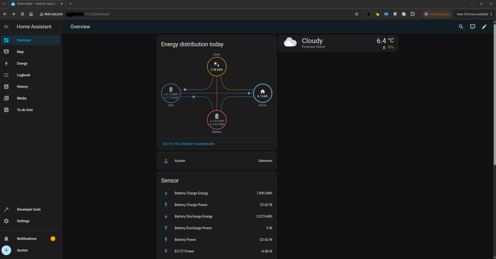
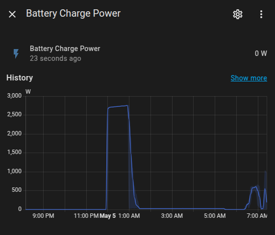
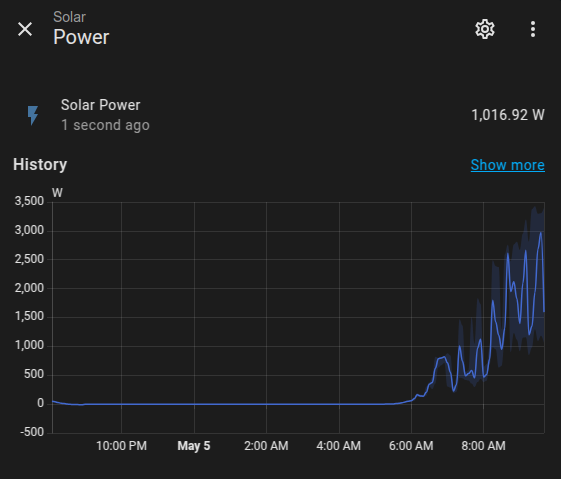

# Using CT6 device with Home Assistant.
One or more CT6 devices can be integrated with homeassistant as detailed below.

## Examples of CT6 Home Assistant Integration.







## Home Assistant Setup

Before attempting to setup home assistant ensure docker and docker-compose are installed. See https://docs.docker.com for more information on docker installation and https://docs.docker.com/compose/install/linux/ on docker-compose installation.

Create a homeassistant folder to hold all your home assistant configuration files. For this example the homeassistant folder sits in the users home dir but it can be in any writable location.

```
cd ~
mkdir homeassistant
cd homeassistant
```

- 🛠️ Step 1: Create docker-compose.yml

In your project directory (e.g., home-assistant), create this docker-compose.yml:

```
version: '3.9'

services:
  homeassistant:
    container_name: homeassistant
    image: ghcr.io/home-assistant/home-assistant:stable
    volumes:
      - ./config:/config
      - /etc/localtime:/etc/localtime:ro
    restart: unless-stopped
    network_mode: host
    privileged: true

  mqtt:
    container_name: mqtt
    image: eclipse-mosquitto
    ports:
      - "1883:1883"
      - "10001:10001"
    volumes:
      - ./mosquitto/config:/mosquitto/config
      - ./mosquitto/data:/mosquitto/data
      - ./mosquitto/log:/mosquitto/log
    restart: unless-stopped
```

🛠️ Step 2: Add Mosquitto Config

Create ./mosquitto/config/mosquitto.conf with minimal setup in the homeassistant folder.

```
persistence true
persistence_location /mosquitto/data/
log_dest file /mosquitto/log/mosquitto.log

listener 1883
allow_anonymous true
```

🛠️ Step 3: Start Home Assistant and the MQTT Server.

```
docker-compose up -d
Creating network "home-assistant_default" with the default driver
Creating homeassistant ... done
Creating mqtt          ... done
```

If at any time you wish to stop the home assistant docker container.

```
docker-compose down
```


- Using ct6_configurator

Go to the MQTT Server tab and enter
CT6 address:            The IP address of the CT6 device on your LAN. This is
                        shown on the CT6 display.
MQTT Server Address:    The address of the machine running the home assistant with
                        the mosquitto MQTT server.
MQTT Server Port:       This can be left at the default of 1883.
MQTT Topic:             Enter the MQTT Topic that best describes the CT6
                        device (E.G  Meter Cupboard A).

Hit the set button and the CT6 device will start sending data to the MQTT server.

🛠️ Step 4: Check CT6 MQTT messages are received by the MQTT server.

 - To check that the MQTT server is receiving the CT6 messages MQTT Explorer can be used.
    See https://mqtt-explorer.com/ fr details of the installation.

 - Open MQTT Explorer
   Here we assume that home assistant/MQTT server is running on the same machine as MQTT explorer.

   - Select the + button to add a connection.
   - Enter a name for the connection (E.G localhost).
   - Enter the Host as 127.0.0.1
   - Select the save button to save this connection.
   - Select the Connect button.

   MQTT Explorer should start displaying the data received from the CT6 device as JSON text.


## Setup Running Home Assistant

- Connect to localhost:8123 using a web browser
- Click on the 'CREATE MY SMART HOME' button.

✅ Initial Home Assistant Setup Steps

    Click: Create My Smart Home

    Create a User Account

        Choose a username, name, and password.

        This account will be your administrator for Home Assistant.

    Set Your Location and Preferences

        Location: Used for sunrise/sunset automation and weather.

        Timezone, unit system (metric/imperial), and currency.

    Auto-Discovery of Devices

        Home Assistant will scan your network for smart devices (e.g. Shelly, TP-Link, Sonoff, Hue, etc.).

        You can choose to set them up now or skip and do it later.

    Home Assistant Is Ready

        You’ll land on the Overview dashboard.

        From there, go to Settings > Devices & Services to add MQTT and other integrations.


## Add MQTT server to home assistant

- Settings > Devices & services > + ADD INTEGRATION button
- Search for MQTT, select just MQTT
 - Enter the hostname or IP address of the MQTT server
   Optionally enter a username and password that clients will need to connect to the server. I left these blank.
 - Select the Submit button.
 - MQTT should now appear in the Configured devices.


## Add CT6 measurement ports

For this example

The CT6 device Meter_Cupboard (MQTT Topic name) has the following CT ports connected

CT6 Port 1 = Grid
CT6 Port 2 = Solar
CT6 Port 3 = Battery
CT6 Port 5 = House

- In Settings > Devices & services select MQTT
- Select the three dots on the right
- Select + Add MQTT Device
 - Enter the name (E.G Grid), leave other fields blank, select Next
 - Change Type of entity from Notifications to Sensor, leave other fields blank, select Next
 - Set Device class to Power, Set the State class to Measurement, Set the Unit of measurement to W, leave advanced settings untouched, select Next
- Enter State topic = Meter_Cupboard, Value Template = {{ value_json.CT1.PRMS | round(2) }}, leave advanced settings untouched, select Next


- In Settings > Devices & services select MQTT
- Select the three dots on the right
- Select + Add MQTT Device
 - Enter the name (E.G Solar), leave other fields blank, select Next
 - Change Type of entity from Notifications to Sensor, leave other fields blank, select Next
 - Set Device class to Power, Set the State class to Measurement, Set the Unit of measurement to W, leave advanced settings untouched, select Next
- Enter State topic = Meter_Cupboard, Value Template = {{ value_json.CT2.PRMS | round(2) }}, leave advanced settings untouched, select Next

- In Settings > Devices & services select MQTT
- Select the three dots on the right
- Select + Add MQTT Device
 - Enter the name (E.G Battery), leave other fields blank, select Next
 - Change Type of entity from Notifications to Sensor, leave other fields blank, select Next
 - Set Device class to Power, Set the State class to Measurement, Set the Unit of measurement to W, leave advanced settings untouched, select Next
- Enter State topic = Meter_Cupboard, Value Template = {{ value_json.CT3.PRMS | round(2) }}, leave advanced settings untouched, select Next

- In Settings > Devices & services select MQTT
- Select the three dots on the right
- Select + Add MQTT Device
 - Enter the name (E.G House CT), leave other fields blank, select Next
 - Change Type of entity from Notifications to Sensor, leave other fields blank, select Next
 - Set Device class to Power, Set the State class to Measurement, Set the Unit of measurement to W, leave advanced settings untouched, select Next
- Enter State topic = Meter_Cupboard, Value Template = {{ value_json.CT5.PRMS | round(2) }}, leave advanced settings untouched, select Next


An also for this example

The CT6 device Meter_Cupboard_2 (MQTT Topic name) has the following CT ports connected

CT6 Port 2 = EV Charger

- In Settings > Devices & services select MQTT
- Select the three dots on the right
- Select + Add MQTT Device
 - Enter the name (E.G EV CT), leave other fields blank, select Next
 - Change Type of entity from Notifications to Sensor, leave other fields blank, select Next
 - Set Device class to Power, Set the State class to Measurement, Set the Unit of measurement to W, leave advanced settings untouched, select Next
- Enter State topic = Meter_Cupboard_2, Value Template = {{ value_json.CT2.PRMS | round(2) }}, leave advanced settings untouched, select Next


Add the following to the end of the config/configuration.yaml file.

```
template:
  - sensor:
      - name: "Grid Import Power"
        unit_of_measurement: "W"
        device_class: power
        state_class: measurement
        state: >
          
          {{ (p | abs) if p < 0 else 0 }}

      - name: "Grid Export Power"
        unit_of_measurement: "W"
        device_class: power
        state_class: measurement
        state: >
          
          {{ (p | abs) if p > 0 else 0 }}

      - name: "Battery Charge Power"
        unit_of_measurement: "W"
        device_class: power
        state_class: measurement
        state: >
          
          {{ (p | abs) if p < 0 else 0 }}

      - name: "Battery Discharge Power"
        unit_of_measurement: "W"
        device_class: power
        state_class: measurement
        state: >
          
          {{ (p | abs) if p > 0 else 0 }}

      - name: "House Power"
        unit_of_measurement: "W"
        device_class: power
        state_class: measurement
        state: >
          {{ states('sensor.house_ct_power') | float(0) | abs }}

      - name: "EV Power"
        unit_of_measurement: "W"
        device_class: power
        state_class: measurement
        state: >
          {{ states('sensor.ev_ct_power') | float(0) | abs }}

      - name: "EV Energy Metered"
        unit_of_measurement: "kWh"
        device_class: energy
        state_class: total_increasing
        state: "{{ states('sensor.ev_energy') | float(0) | abs }}"

sensor:
  - platform: integration
    source: sensor.grid_import_power
    name: "Grid Energy Import"
    unit_prefix: k
    round: 3
    method: trapezoidal

  - platform: integration
    source: sensor.grid_export_power
    name: "Grid Energy Export"
    unit_prefix: k
    round: 3
    method: trapezoidal

  - platform: integration
    source: sensor.solar_power
    name: "Solar Energy"
    unit_prefix: k
    round: 3
    method: trapezoidal

  - platform: integration
    source: sensor.battery_charge_power
    name: "Battery Charge Energy"
    unit_prefix: k
    round: 3
    method: trapezoidal

  - platform: integration
    source: sensor.battery_discharge_power
    name: "Battery Discharge Energy"
    unit_prefix: k
    round: 3
    method: trapezoidal

  - platform: integration
    source: sensor.house_power
    name: "House Energy"
    unit_prefix: k
    round: 3
    method: trapezoidal

  - platform: integration
    source: sensor.ev_power
    name: "EV Energy"
    unit_prefix: k
    round: 3
    method: trapezoidal
```

- Restart the homeassistant docker container.

```
docker restart homeassistant
```

- Check in Developer Tools > States that the following are all showing the expected numbers.

sensor.grid_energy_import
sensor.grid_energy_export
sensor.solar_energy
sensor.battery_charge_energy
sensor.battery_discharge_energy
sensor.house_energy


✅ Set up the Energy Dashboard

    Go to:
    Settings > Dashboards > Energy

    Grid Consumption

        Energy consumed from the grid: select sensor.grid_energy_import

        Energy returned to the grid: select sensor.grid_energy_export

    Solar Production (optional)

        If you have a solar energy sensor: add sensor.solar_energy

    Battery (optional)

        Battery charge sensor: the energy going into the battery

        Battery discharge sensor: energy coming out of the battery

    Individual devices (House)

        Scroll to "Individual devices"

        Add sensor.house_energy to see what your house is using overall

    Individual devices (Electric vehicle).

    Add sensor.ev_energy_metered to see the ev charge power

    Save and wait
    The Energy Dashboard updates hourly, so you might not see data immediately.


### View Home Assistant logs

If at any time you need to view the home assistant logs

```
docker logs homeassistant
```


